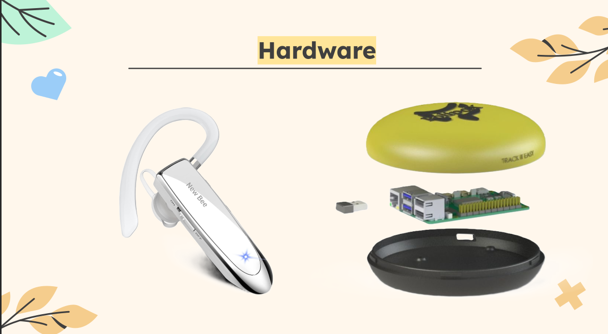
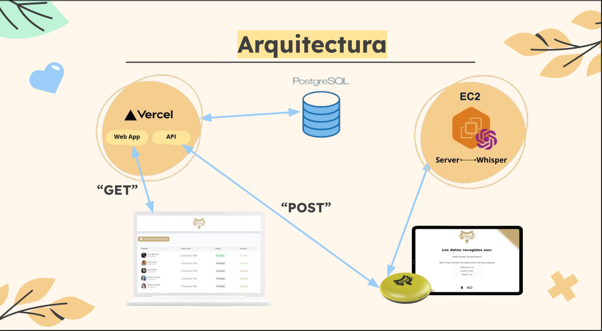
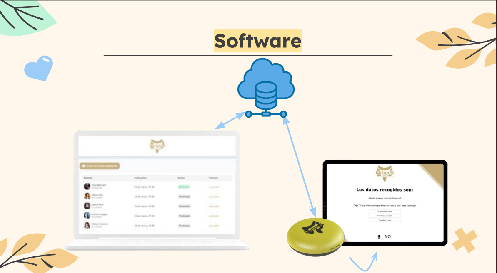

# PolipoX

Proyecto de equipo — Hackathon IMIBIC 2024, en colaboración con el Hospital Universitario Reina Sofía de Córdoba.

Durante una colonoscopia, el médico detecta y describe los pólipos en voz alta, pero tiene que parar la exploración para anotarlo todo a mano después. PolipoX es un asistente de voz que permite registrar esas características —localización, tamaño, clasificación clínica (NICE, JNET, Paris)— sin soltar el endoscopio ni mirar una pantalla.

  

## Cómo funciona

  

- **Dispositivo** — un Raspberry Pi con un auricular Bluetooth, alojado en una carcasa propia, captura la voz del clínico durante la exploración.
- **Captura de audio** (`utils.py`, `main.py`) — arquitectura productor-consumidor con `multiprocessing`: un proceso graba audio en continuo con PyAudio y lo encola; otro lo procesa según va llegando.
- **Transcripción** — el audio se envía por HTTP a un servidor (EC2) que ejecuta Faster-Whisper, el modelo de reconocimiento de voz de código abierto de OpenAI.
- **Interpretación de comandos** (`states.py`) — una máquina de estados interpreta la transcripción y va guiando al clínico por los distintos campos clínicos a rellenar por voz.
- **Plataforma web** — los datos recogidos se envían a una web (Vercel + PostgreSQL) donde el equipo clínico puede consultar los registros de cada exploración.

  

## Mi parte en el proyecto

Fue un proyecto de equipo desarrollado en el formato de tiempo limitado propio de un hackathon, y como suele pasar en ese formato, todos acabamos metiendo mano en todas las partes. Participé en el conjunto del proyecto — desde el montaje y las pruebas del dispositivo físico hasta la integración con la plataforma web —, aunque mi foco principal estuvo en el software del propio dispositivo: la captura y el procesamiento de audio en Python (la arquitectura productor-consumidor con `multiprocessing`) y la máquina de estados que interpreta los comandos de voz y guía al clínico por los distintos campos a rellenar.

## Stack

## Nota sobre esta versión pública

La URL del servidor de transcripción se ha sustituido por una variable de entorno (`TRANSCRIPTION_SERVER_URL`) y no se incluye ningún endpoint real, ya que el servidor del hackathon ya no está activo.
